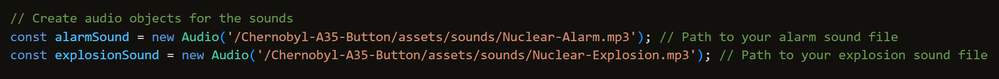

# Chernobyl A3-5 Button

## The Infamous A3-5 Button, Which Acted as a Detonator in the Chernobyl Incident.

This was a mini project I did the weekend prior to my second hackathon, to test my JavaScript knowledge.

The hardest part about this project was the CSS. I had to create a detailed button with lot's of texture, so that it had a much more realistic look.

I also used two external mp3 files, so that when you click the button, an alarm plays. Then, as soon as the alarm mp3 finishes, the explosion mp3 plays. This took me a while to complete, as the GitHub pages deployed websites need a different file path location when using JavaScript.

This is still a *work in progress* and I will add camera shake to the page when the explosion mp3 plays.
